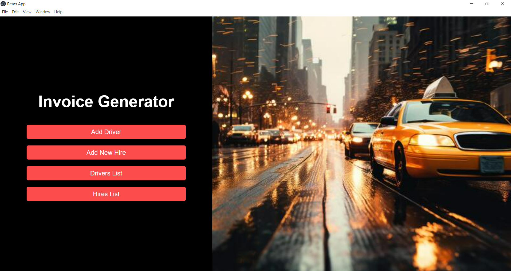

# Invoice_Generating_Desktop_ApplicationApp

This desktop application was created to meet the specific needs of Express Lanka Tours, a cab service company, by automating the generation of invoices. The app efficiently manages the company’s driver, vehicle, and hire details, ensuring that invoices are accurately generated based on relevant data. It offers a streamlined solution for managing invoicing processes, reducing manual work, and minimizing errors. Additionally, the system provides a centralized platform for keeping records organized, allowing the company to access and track important information seamlessly.

## Table of Contents

- [Project Interfaces](#project-interfaces)
- [Technologies Used](#technologies-used)
- [Prerequisites](#prerequisites)
- [Installation](#installation)
- [Packaging and Distribution](#packaging-and-distribution)

## Project Interfaces

### Home Screen


### Add Driver


### Add New Hire


### Drivers List


### Hires List


## Technologies Used

- React
- Electron
- Node.js

## Prerequisites

- [Node.js](https://nodejs.org/) (version 14 or above recommended)
- [npm](https://www.npmjs.com/) or [Yarn](https://yarnpkg.com/)

## Installation

1. **Clone the repository**:

   ```bash
   git clone https://github.com/PamudiNaveesha/Invoice_Generating_Desktop_Application.git
   cd your-repo-name

2. **Install dependencies**:

   ```bash
   npm install

3. **Run the app in development mode**:

   ```bash
   npm start

## Packaging and Distribution

1. **Install Electron Forge**:

   ```bash
   npm install --save-dev @electron-forge/cli

2. **Build the app**:

   ```bash
   npm run build

3. **Package the app**:

   ```bash
   npm run package

